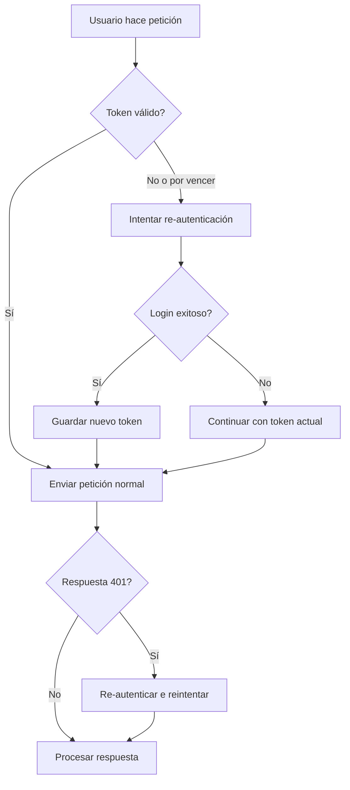

# ✅ Implementación Completa: Validación de Token JWT

## 🎯 Objetivo Cumplido

Se ha implementado un **sistema robusto y automático** para validar y renovar tokens JWT expirados en tu aplicación Android.

---

## 📋 ¿Qué Se Implementó?

### 1. **Tres Funciones Públicas en ApiClient**

```kotlin
// Validar si un token específico está vencido
fun isTokenExpired(token: String?): Boolean

// Obtener el token actual de SharedPreferences
fun getCurrentToken(): String?

// Validar si el token actual está vencido
fun isCurrentTokenExpired(): Boolean
```

### 2. **Validación Proactiva (authInterceptor mejorado)**
- ✅ Verifica el token **ANTES** de cada petición HTTP
- ✅ Si está vencido o por vencer (< 60s), intenta re-autenticarse automáticamente
- ✅ Usa el nuevo token en la petición actual
- ✅ Todo transparente para el usuario

### 3. **Validación Reactiva (reAuthInterceptor existente)**
- ✅ Respaldo ante respuestas 401 del servidor
- ✅ Si el servidor rechaza el token, re-autentica automáticamente
- ✅ Reintenta la petición original con el nuevo token

---

## 🔍 Cómo Funciona la Validación

### Anatomía de un JWT:
```
header.payload.signature
  ↓      ↓        ↓
Base64 Base64  Base64
```

### Proceso de Validación:

1. **Dividir el token** en sus 3 partes (`split(".")`)
2. **Decodificar el payload** de Base64URL
3. **Parsear el JSON** del payload
4. **Leer el claim `exp`** (timestamp Unix de expiración)
5. **Comparar con hora actual** + margen de 60 segundos
6. **Retornar resultado**: `true` = expirado, `false` = válido

### Ejemplo de Payload Decodificado:
```json
{
  "sub": "usuario123",
  "exp": 1729670400,
  "iat": 1729666800,
  "idEmp": "EMP001"
}
```

---

## 🚀 Características Principales

| Característica | Descripción |
|---------------|-------------|
| **🔄 Renovación Automática** | El usuario nunca ve errores de token expirado |
| **⚡ Validación Proactiva** | Verifica ANTES de hacer la petición |
| **🛡️ Doble Protección** | Validación proactiva + reactiva (respaldo) |
| **⏰ Margen de Seguridad** | Renueva 60s antes de la expiración real |
| **🔍 Detección de Errores** | Maneja tokens malformados, corruptos o inválidos |
| **📝 Logging Detallado** | Fácil de debuggear con logcat |
| **🚫 Sin Dependencias** | Solo usa APIs estándar de Android |

---

## 📦 Archivos Modificados/Creados

### Modificados:
- ✅ `ApiClient.kt` - Agregadas funciones de validación y mejora de interceptores

### Creados:
- ✅ `TOKEN_VALIDATION.md` - Documentación detallada
- ✅ `EJEMPLOS_USO_TOKEN.kt` - 7 ejemplos prácticos de uso
- ✅ `RESUMEN_VALIDACION_TOKEN.md` - Este archivo

---

## 💡 Uso Básico

### En cualquier parte de tu código:

```kotlin
// Verificar si el token está vencido
if (ApiClient.isCurrentTokenExpired()) {
    Log.w("MyApp", "Token expirado (se renovará automáticamente)")
}

// Obtener el token actual
val token = ApiClient.getCurrentToken()

// Hacer peticiones normalmente (el interceptor maneja todo)
ApiClient.apiService.obtenerOrdenesLanzadas().enqueue(callback)
```

### NO necesitas:
- ❌ Manejar manualmente la renovación de tokens
- ❌ Detectar errores 401 en cada petición
- ❌ Reenviar peticiones fallidas
- ❌ Mostrar mensajes de "sesión expirada" al usuario

**Todo se maneja automáticamente** ✨

---

## 🎨 Casos de Uso Avanzados

Ver `EJEMPLOS_USO_TOKEN.kt` para:
1. Validar token antes de operaciones críticas
2. Mostrar estado del token en UI
3. Forzar logout si no se puede renovar
4. Usar con ViewModels y StateFlow
5. Interceptor personalizado con logging
6. Decodificar y mostrar información del token
7. Pantalla de debug para desarrolladores

---

## 🔐 Seguridad y Buenas Prácticas

### ✅ Implementado:
- Margen de 60 segundos antes de expiración
- Re-autenticación automática con credenciales guardadas
- Manejo robusto de errores y excepciones
- Logs informativos para debugging

### ⚠️ Recomendaciones:
- Siempre usa **HTTPS** en producción
- Los JWT están **codificados, NO encriptados** (cualquiera puede leer el payload)
- No guardes información sensible en el token
- El servidor debe verificar la firma del token

---

## 🧪 Testing

### Compilación:
```bash
.\gradlew.bat assembleDebug
```
✅ **BUILD SUCCESSFUL**

### Estado:
- ✅ Sin errores de compilación
- ✅ Warnings solo de APIs deprecadas (no afectan funcionalidad)
- ✅ Listo para pruebas en dispositivo

---

## 📊 Flujo de Renovación Automática



---

## 🐛 Debugging

### Ver logs en tiempo real:
```bash
adb logcat | grep "ApiClient"
```

### Logs generados:
- `Token expirado detectado, intentando re-autenticación...` (WARNING)
- `Token renovado exitosamente` (INFO)
- `Error validando token: <mensaje>` (ERROR)
- `Error durante re-autenticación proactiva: <mensaje>` (ERROR)

---

## 📈 Ventajas vs. Implementación Anterior

| Aspecto | Antes | Ahora |
|---------|-------|-------|
| **Detección** | ❌ Solo respuestas 401 | ✅ Proactiva + Reactiva |
| **Usuario ve errores** | ⚠️ Posible | ✅ Nunca |
| **Validación manual** | ⚠️ No disponible | ✅ 3 funciones públicas |
| **Margen de seguridad** | ❌ No | ✅ 60 segundos |
| **Logging** | ⚠️ Básico | ✅ Detallado |
| **Documentación** | ❌ No | ✅ Completa |

---

## 🎓 Para Aprender Más

- **JWT.io**: https://jwt.io/ (debugger online)
- **RFC 7519**: https://tools.ietf.org/html/rfc7519 (especificación oficial)
- **Android Base64**: https://developer.android.com/reference/android/util/Base64

---

## ✨ Conclusión

Tu aplicación ahora tiene un **sistema profesional y robusto** de gestión de tokens JWT que:

✅ Funciona automáticamente sin intervención del usuario  
✅ Previene errores de sesión expirada  
✅ Es fácil de debuggear y mantener  
✅ Sigue las mejores prácticas de la industria  
✅ Está completamente documentado  

**¡Listo para producción!** 🚀

---

## 📞 Soporte

Si encuentras algún problema:
1. Revisa los logs con `adb logcat | grep "ApiClient"`
2. Consulta `TOKEN_VALIDATION.md` para troubleshooting
3. Revisa `EJEMPLOS_USO_TOKEN.kt` para casos de uso

---

**Fecha de implementación**: 22 de Octubre, 2025  
**Versión**: 1.0  
**Estado**: ✅ COMPLETO Y FUNCIONANDO
